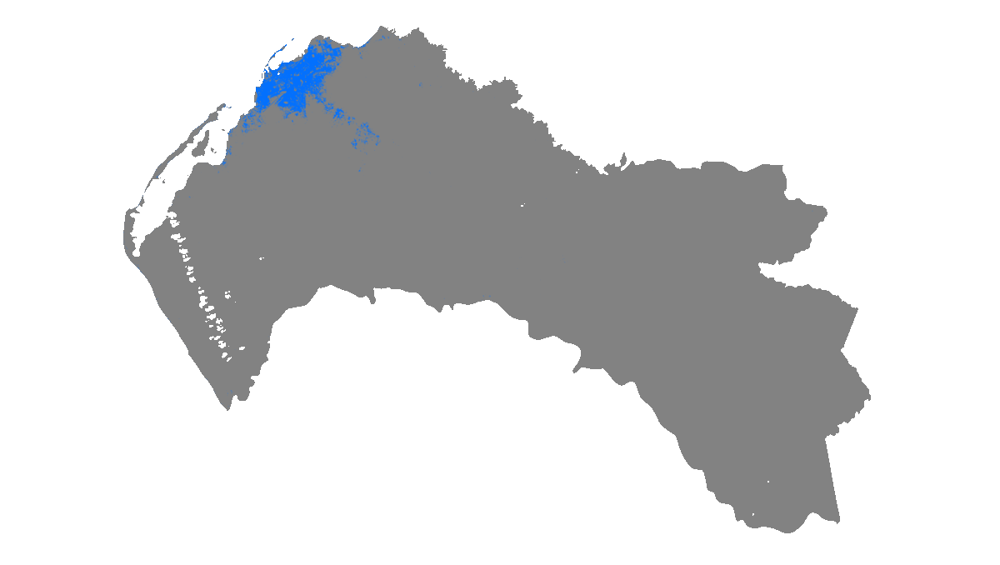

# Integrating GIS Remote Sensing and Machine Learning to monitor urban expansion

<kbd></kbd>

## To reproduce the results: 

Make sure to download the dataset from http://dx.doi.org/10.17632/hkfxnm2xpk.1 and change the paths in the scripts.

## arcgis toolbox & QGIS plugin

As part of this research, an arcGIS toolbox and a QGIS plugin were developed:

[pqkmeans-arctoolbox](https://github.com/arngolo/pqkmeans-arctoolbox)  
[pqkmeans-qgis-plugin](https://github.com/arngolo/pqkmeans-qgis-plugin)  

### Citation: 

#### Dataset
Ngolo, A. M. E (2020), “Built-Up expansion monitoring (Luanda City, Angola)”, Mendeley Data, V1, [doi:10.17632/hkfxnm2xpk.1](http://dx.doi.org/10.17632/hkfxnm2xpk.1)

#### Paper
Ngolo, A. M. E & Teiji Watanabe (2022) Integrating geographical information systems, remote sensing, and machine learning techniques to monitor urban expansion: an application to Luanda, Angola, Geo-spatial Information Science, [DOI:10.1080/10095020.2022.2066574](https://doi.org/10.1080/10095020.2022.2066574)
